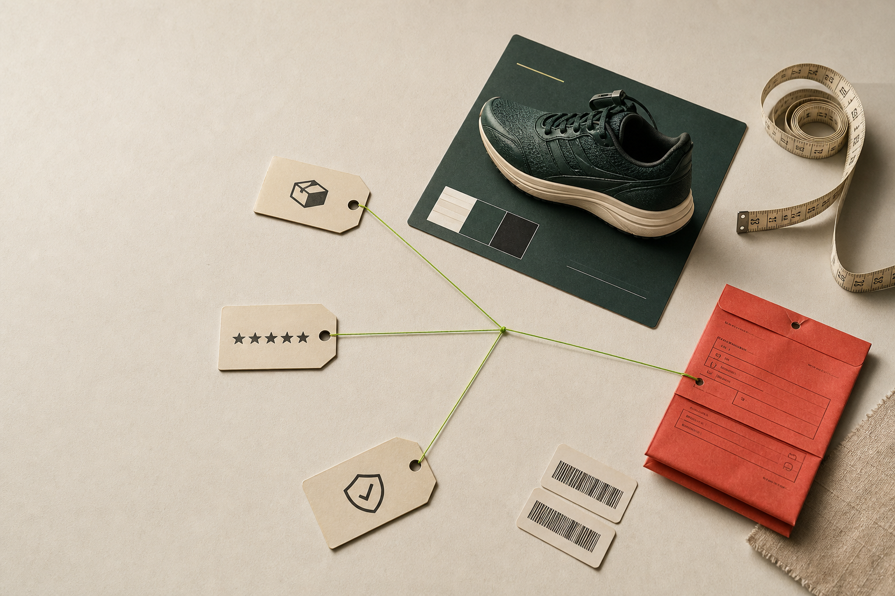

# CartCause

**Daily profit leak brief with approve-ready fixes for founder-led ecommerce stores.**



CartCause connects deterministic order and return metrics with the language hidden in reviews, support notes, return reasons, and product-page promises. GPT-5.6 ranks the likely causes, cites the evidence behind each hypothesis, and drafts the smallest product-page or CX changes an owner can approve today.

The public demo uses a fictional store named **Morrow Supply**. Every order count, rate, and dollar value is explicitly sample data.

## Why CartCause

Revenue dashboards show what happened. Returns tools process what happened. CartCause is focused on the decision in between:

> Which product promise likely leaked margin yesterday, what evidence supports that hypothesis, and what is the smallest safe fix to approve now?

The product is intentionally not a chatbot, general analytics suite, return portal, or automatic storefront editor. It produces one evidence-linked morning brief and ends with an owner-approved implementation handoff.

## Demo loop

1. Open the Morrow Supply sample brief.
2. Run a live GPT-5.6 analysis.
3. Select a ranked leak candidate.
4. Inspect the exact return, review, support, and PDP evidence IDs.
5. Compare current copy with approval-ready fixes.
6. Approve a product or CX change.
7. Copy the implementation brief.

## GPT-5.6 integration

The serverless `/api/analyze` endpoint uses the OpenAI Responses API with:

- model alias `gpt-5.6`
- medium reasoning effort
- `store: false`
- a request-scoped API key supplied by the user at run time
- a privacy-preserving hashed `safety_identifier`
- Zod Structured Outputs through `zodTextFormat`

GPT-5.6 does **not** calculate money, counts, or rates. The structured output schema contains no monetary field. The model returns one ranked analysis per candidate, a bounded cause hypothesis, confidence, evidence references, recommended fixes, and a `what_not_to_claim` guardrail.

The server performs a second semantic validation pass:

- every candidate must appear exactly once
- ranks must be a unique `1..N` sequence
- every evidence ID must exist and belong to the cited candidate
- the response must not contain monetary language

The browser then merges the validated analysis with the original deterministic metrics.

## Architecture

```text
React browser app
  -> fictional candidate metrics and redacted evidence
  -> request-scoped API key held in tab memory
  -> POST /api/analyze
  -> Zod request validation
  -> OpenAI Responses API with GPT-5.6
  -> strict structured output
  -> semantic reference validation
  -> evidence desk and owner approval flow
```

Stack:

- Vite, React, and TypeScript
- Tailwind CSS v4
- Motion
- Phosphor Icons
- OpenAI JavaScript SDK
- Zod
- Vercel Functions
- Vitest and Testing Library

## Trust boundary

- The demo requires no customer names, emails, addresses, phone numbers, or full order logs.
- Only bounded sample aggregates and short evidence excerpts reach the model.
- The public demo uses bring-your-own-key access: the key stays in React memory, is sent only over HTTPS for the current request, and is cleared immediately after each live call starts.
- CartCause never writes the key to browser storage, cookies, application logs, responses, or Vercel environment variables.
- A failed live request leaves the clearly labeled sample brief intact.
- CartCause does not write to a store, auto-publish changes, or persist customer data.
- Model hypotheses always include confidence, evidence IDs, and a limit on what may be claimed.

## Local setup

Requirements:

- Bun 1.3+
- an OpenAI API key with access to GPT-5.6 for the optional live brief

```bash
bun install
bun run dev
```

The static sample experience runs without a key. In the deployed app, paste a key into the **Bring your own key** panel to exercise `/api/analyze`; it remains only in that tab's memory. Use a serverless-compatible local runtime to exercise the same endpoint locally.

The public deployment does not require a server-side `OPENAI_API_KEY` environment variable.

## Verification

```bash
bun run test
bun run typecheck
bun run build
```

The automated suite covers seeded-data arithmetic, request validation, identifier uniqueness, evidence ownership, rank integrity, and the no-money model-output boundary. The live API contract was also exercised against `gpt-5.6`, which resolved to `gpt-5.6-sol` and returned a valid parsed result.

## How Codex accelerated the build

Codex served as the primary build environment and coordination layer during OpenAI Build Week. The project was created from an empty directory during the event. Codex helped:

- inspect the official rules and submission form
- research current ecommerce-owner discussions on Reddit, Shopify Community, and X
- compare three product wedges before selecting the daily margin-leak brief
- coordinate bounded product, research, frontend, API, and design-review agents
- implement the React experience and GPT-5.6 contract in parallel
- run tests, browser interaction checks, accessibility review, and production builds
- create the editorial campaign visual with the built-in ImageGen tool

## Human decisions

The human-directed decisions that shaped the product were:

- change the original developer-tool direction into an ecommerce product for store owners
- make GPT-5.6 a real API feature, not only a build-time assistant
- focus on one daily operating decision instead of a broad analytics suite
- keep all financial arithmetic deterministic
- require evidence references and an explicit claim boundary
- stop at owner approval instead of automatically editing a live storefront

## Build Week scope

This repository is a new Build Week project. The public demo deliberately uses fictional data and excludes commerce-platform authentication, automatic publishing, billing, accounts, and durable customer storage.

Additional product, architecture, research, demo, and submission notes are in [`docs/`](docs/).

## License

[MIT](LICENSE)
